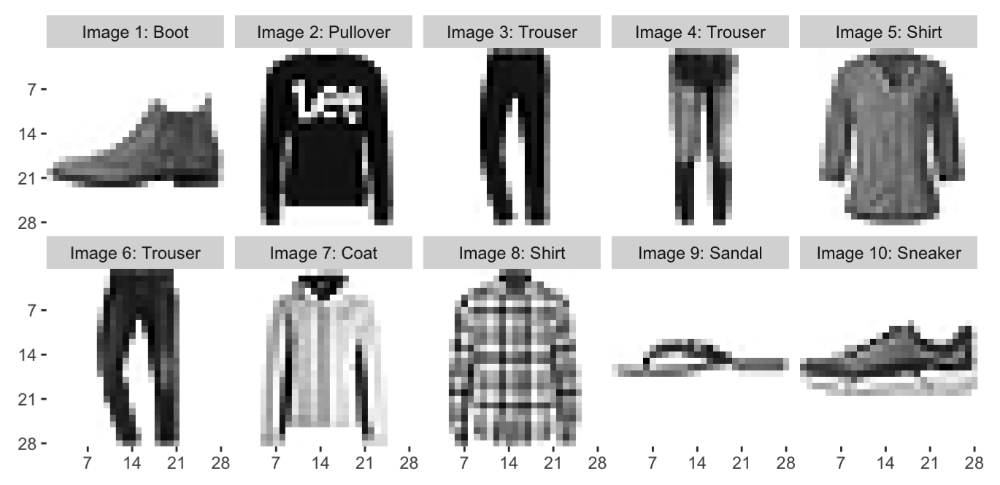

# Fashion MNIST Classification using Deep Neural Networks

`Fashion-MNIST` is a dataset of Zalando's article images—consisting of a training set of 60,000 examples and a test set of 10,000 examples. Each example is a 28x28 grayscale image, associated with a label from 10 classes. Fashion-mnist dataset is also used for benchmarking machine learning algorithms. For more information, please refer to the original [dataset](https://github.com/zalandoresearch/fashion-mnist)
<br>
<br>
Here is an example of how the dataset looks like:
<p align="center">
  
</p>

## Contents
  * [How to load dataset?](#data-installation)
  * [Model Building](#model-building)
  * [Hyperparameter Tuning/Keras Tuner](#hyperparameter-tuning)
  * [Summary](#summary)
  * [Resources](#resources)

## How to load dataset? <a name="data-installation"></a>
There are multiple ways to load the dataset, in this project the `Fashion-MNIST` dataset is loaded from `keras`

```
from tensorflow import keras
fashion_mnist = keras.datasets.fashion_mnist # loading dataset 
(train_images, train_labels), (test_images, test_labels) = fashion_mnist.load_data()
```

**After loading the dataset there are some pre-processing steps, please follow the notebook.** 

## Model Building: <a name="model-building"></a>
We used simple keras Sequential model with three different layers input layer, 1 hidden layer and output layer. Input layer consists of 784 neurons, output layer consists of 10 neurons this is due to the fact that we are having fashion articles from 10 different classes. The below code is used to build the architecture of the model and compilation:
```
model = keras.Sequential()
model.add(keras.layers.Flatten(input_shape=(28, 28))) # input layer 
model.add(keras.layers.Dense(128, activation='relu')) # hiddel layer
model.add(keras.layers.Dense(10, activation='softmax')) # output layer

model.compile(optimizer='adam', 
              loss='sparse_categorical_crossentropy', 
              metrics=['accuracy'])
```

## Hyperparameter Tuning/Keras Tuner: <a name="hyperparameter-tuning"></a>
There are four different hyperparameter tunning methods including RandomSearch, Hyperband, BayessianOptimization and cross-validation from sklearn. In this project, I tried out `Hyperband` technique from keras-tuner. The method to install keras tuner is as follows:
```
# install and import the keras tuner 
!pip install -q -U keras-tuner

import keras_tuner as kt
```
There is interactive method for huyperparameter tuning called [Hparams Dashboard](https://www.tensorflow.org/tensorboard/hyperparameter_tuning_with_hparams), I will use in upcoming projects. 

## Summary: <a name="summary"></a>

The followwing important points to notice:

* Developed a deep neural network classifier with three layers, the input layer, 1 hidden layer and output layer
* Input layer consists of 784 neurons, output layer consists of 10 neurons this is due to the fact that we are having fashion articles from 10 different classes.
* For hyperparameter tuning, we have used `Hyperband` technique although there are other methods available.
* After hyperparameter tuning, we got 416 neurons are required for the hidden layer, it requires 35 epochs to train the model and an `early-stopping` scheme is used to prevent model from overfitting.
* The validation accuracy is **89.52%** while the test accuracy is **88.60%**

## Resources: <a name="resources"></a>
1. [Fasion-MNIST dataset](https://github.com/zalandoresearch/fashion-mnist)
2. [Introduction to keras Tuner](https://www.tensorflow.org/tutorials/keras/keras_tuner)
